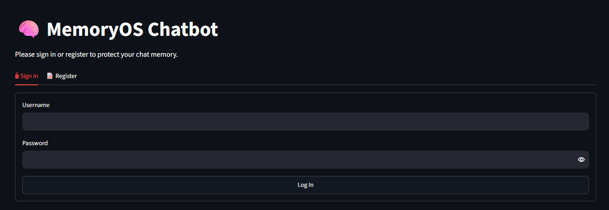
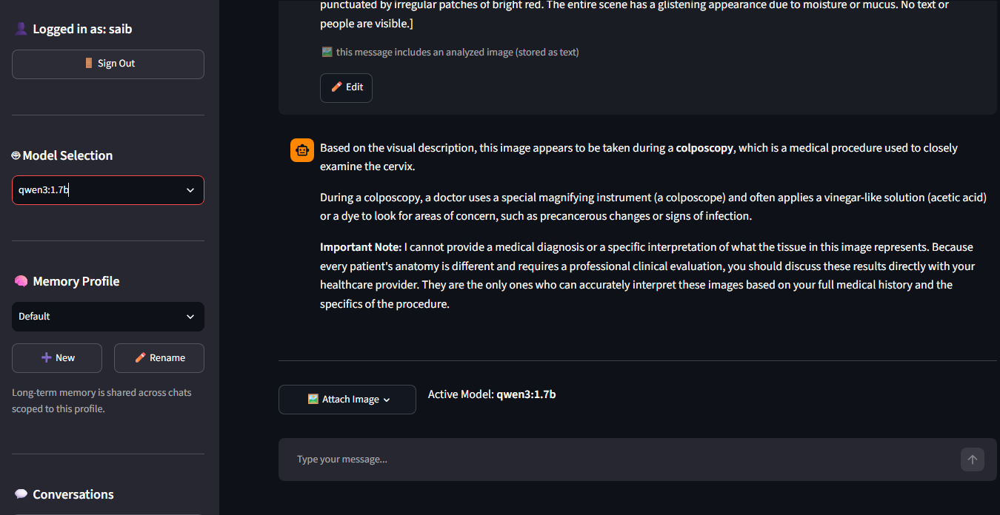
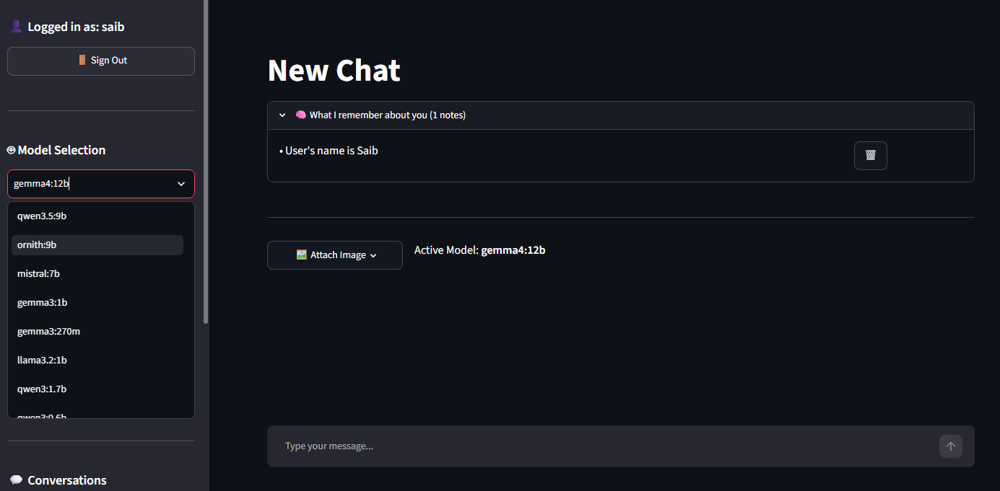

# 🐘 MemoryOS

MemoryOS is a fully local, multi-user educational sandbox application designed to demonstrate and explore modern LLM memory design patterns. It integrates **LangGraph** checkpointers, **PostgresStore** long-term persistent keyspaces, and dynamic **Ollama** model execution into an interactive web interface.

🔗 **Repository:** [https://github.com/Saibhossain/MemoryOS.git](https://github.com/Saibhossain/MemoryOS.git)

---

## 📸 Screenshots

**User Login Page**  


<br>

**Short-Term Memory**  


<br>

**Long-Term Memory**  


---

## 💡 What You Will Learn

This repository acts as an interactive playground to study the core concepts of memory representation in modern LLM applications:

1. **Short-Term (Thread-Scoped) Memory**:
   - Studied via LangGraph checkpoints.
   - Message turns are preserved in the Postgres database, keyed by thread IDs, allowing the model to recall recent statements inside a single conversation.

2. **Long-Term Memory (Cross-Thread Profiles)**:
   - Persisted via LangGraph's `PostgresStore` backend.
   - Facts and preferences are scoped to a specific *user profile* and shared across multiple conversation threads.
   - Saves memories dynamically using tool calling (function calls) or automatic prompt-based extraction fallback for older/smaller models.

3. **Context Summarization**:
   - Overcomes model context length constraints without losing memory history.
   - Automatically summarizes older turns into a sliding-window running summary, ensuring active context remains compact while raw records are preserved intact for the UI.

4. **Multi-User Chat Isolation**:
   - Isolates chats and long-term memory profiles per user using username-scoped tables and a secure login gating layer.

---

## 📂 Project Structure

```bash
MemoryOS/
├── Chatbot/
│   ├── app.py             # Main Streamlit chat UI (login, model selector, inline editing, popover uploader)
│   ├── graph.py           # LangGraph state machine, dynamic Ollama model setup, and fallback vision logic
│   ├── init_db.py         # Database schema initialization and column migration script
│   ├── utils.py           # Image preprocessing and message conversion helpers
│   └── memory_tools.py    # Factories for LLM tools (add_memory, forget_memory)
├── DB/
│   ├── connection.py      # Database connection pool settings (psycopg_pool)
│   ├── chat_sessions.py   # Scoped conversation metadata management
│   ├── profiles.py        # Profile lifecycle and memory scoping operations
│   ├── users.py           # Authentication table setup and hashing functions
│   ├── summary_context.py # Thread summaries outside checkpointer state
│   └── monitor_app.py     # Multi-user analytics monitor dashboard (Plotly, system metrics)
├── .env                   # Database URI and Ollama model environment variables
├── requirements.txt       # Python package requirements
└── README.md              # This documentation
```

---

## 🛠️ Local Setup Guide

Follow these steps to set up and run MemoryOS locally:

### 1. Prerequisites
- **Python**: version `3.10` or higher.
- **PostgreSQL**: A running local Postgres instance.
- **Ollama**: Installed locally from [ollama.com](https://ollama.com/).

### 2. Model Installation
Pull the models you wish to use:
```bash
# Pull a text/chat model
ollama pull qwen3:1.7b

# Pull a vision-capable model (for image OCR fallbacks)
ollama pull qwen2.5vl
```

### 3. Clone & Environment Setup
Clone the repository:
```bash
git clone https://github.com/Saibhossain/MemoryOS.git
cd MemoryOS
```

Create a virtual environment and install the required dependencies:
```bash
python -m venv .venv
.venv\Scripts\activate # On Unix/macOS: source .venv/bin/activate
pip install -r requirements.txt
```

Create a `.env` file in the project root:
```env
DATABASE_URL=postgresql://<YOUR_USER>:<YOUR_PASSWORD>@localhost:5432/<YOUR_DB>?sslmode=disable
OLLAMA_MODEL=qwen3:1.7b
OLLAMA_BASE_URL=http://localhost:11434
```

### 4. Database Setup & Migrations
Run the database initialization script:
```bash
python Chatbot/init_db.py
```

### 5. Launch the Applications
Open two terminals with activated virtual environments:

- **Run the Chatbot App:**
  ```bash
  streamlit run Chatbot/app.py
  ```

- **Run the Monitor Dashboard:**
  ```bash
  streamlit run DB/monitor_app.py
  ```

---
# 👨‍💻 Author
# **Md Saib Hossain**
**AI Engineer • AI / ML / LLM & AI Safety Researcher**  
**Agentic AI Developer • Researcher in Autonomous & Multi-Agent Systems • Advanced Agentic AI Architect**

Designing safe, scalable, and human-centered intelligent systems for real-world healthcare and autonomous AI applications.

<p align="left">
  <a href="mailto:saibhossain5@gmail.com">
    
  </a>
  <a href="https://saibhossain.github.io/">
    
  </a>
  <a href="https://github.com/Saibhossain">
    
  </a>
  <a href="https://linkedin.com/in/saib-hossain-182834229">
    
  </a>
</p>